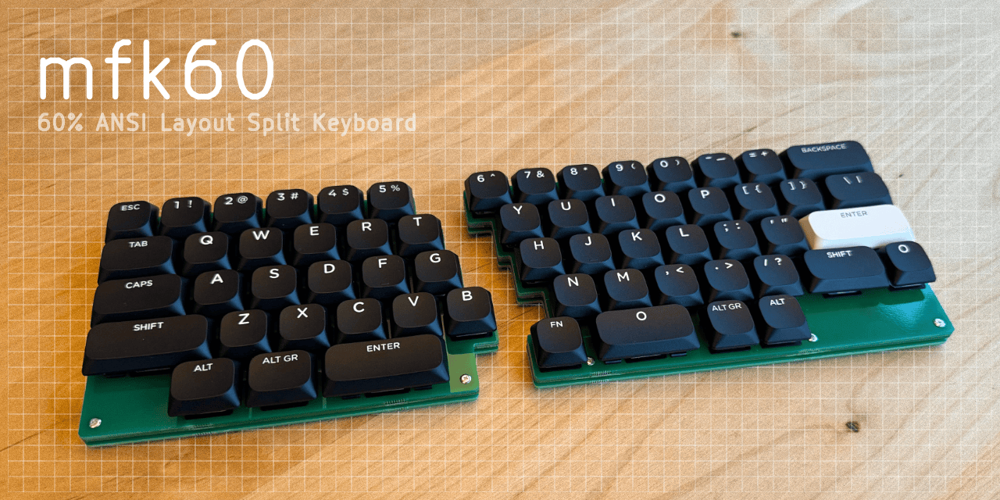

mfk60
=====

60% ANSI Layout Split Keyboard. mfk60 is My First Keyboard, 60%.



- A split keyboard that has 60% ANSI Layout.
- Swappable Gateron Low-Profile MX keycap compatible switches.
- Thin design as MacBook Pro.
- USB-C interface.
- Fully customizable with [QMK firmware](https://qmk.fm/) and
  [VIA](https://www.caniusevia.com/) configuration.


Overview
--------

mfk60 is built with 4 layered boards, the top plate, middle plate, primary
PCB where the entire circuit exists, and bottom plate.

Each board is designed in separated KiCad project due to limitation of
KiCad which project can have only one board design.
Each layer board design contains both left and right designs.

- `sym-lib-table`, `fp-lib-table` are shared for additional symbol and
  footprint for all PCBs.
- `Library` contains additional symbols and footprints to KiCad.
- `mfk60.kicad_*` is the primary PCB of the keyboard.
- `mfk60_*_plate.kicad_*` are the each board layered with
  the primary PCB.
- `bin` contains tooling scripts.
- `mfk60_keyboard-layout.json` is key layout file for
  [Keyboard Layout Editor](http://www.keyboard-layout-editor.com/).


Build
-----

Since mfk60 is built with multiple KiCad projects, there are tooling
scripts to make the process easier.

### Overview

- `mfk60_keyboard-layout.json` to set the key layout.
- `make apply_layout` to apply the key layout to the primary PCB.
- `bin/prepare_plate_board.py` to sync the primary PCB and
  other layered board.
- `make panelize` to produce panelized boards that has frame and
  mouse bites.
- Produce Gerber files and BOM manually from KiCad projects for each board.

### Prerequisite

The board and tooling scripts are implemented by using
[KiCad](https://www.kicad.org/) 7.0.10 on macOS.

Please use KiCad 7.0.10 (or later, which is not tested.)

It should work on the other platform, however, you may need to use
`KICAD_PYTHON_PATH` to set where KiCad `python` exists
if it's not macOS or KiCad is installed on the different path
as like following.

```bash
env KICAD_PYTHON_PATH=/path/to/kicad/python bin/python.sh bin/update_plate_board.py
```

Each board is using symbols and footprints served from
[KiKit](https://github.com/yaqwsx/KiKit), which is referenced from
`.venv` library installation.
Thus, to open these PCB files, first need to install KiKit library.
To install KiKit, simply run `bin/kikit.sh`.

### Set key layout

Edit key layout on [Keyboard Layout Editor](http://www.keyboard-layout-editor.com/),
export the layout to `mfk60_keyboard-layout.json` then
use `apply_layout` goal to sync `mfk60_keyboard-layout.json`
to the primary PCB.

```bash
make apply_layout
```

Of course, it will invalidate existing PCB design, thus changing key
layout causes A LOT of work downstream.

### Sync layered boards

To sync Edge Cut and footprint positioning between the primary PCB and
the layered boards, use `bin/update_plate_board.py` with `bin/python.sh`.

```bash
bin/python.sh bin/update_plate_board.py
```

### Add frame and panelize

To produce final panelized projects with frame, use `panelize` make goal.

```bash
make panelize
```

This goal produces `mfk60*_panelized.kicad_*` files.
It adds frame, mouse bites and moves `JLCJLCJLCJLC` text onto the frame,
where is replaced with order number by [JLCPCB](https://jlcpcb.com/).

Panelized projects are final data that can be used to produce production
Gerber data. Recommend to use
[Fabrication Toolkit](https://github.com/bennymeg/JLC-Plugin-for-KiCad)
for JLCPCB but not limited ot it.


KiKit
-----

Due to multiple reasons as described below, this project is using
[forked version of KiKit](https://github.com/niw/KiKit/tree/v1.4.0_with_workaround).
`bin/kikit.sh` is automatically installs forked version of it in `.venv`,
therefore it's opaque to you.

### KiCad and Python Bindings

As of day this document is written, KiCad 7.0.10 and prior version has
a not well-known "behavior" (or simply say, a bug) in its Python binding
generated by [Swig](https://www.swig.org/).

Due to this issue, released KiKit will not work properly and may crash.
The forked version of it contains a workaround for this behavior.

### Multiple Polygons

Each layered board has both left and right ones, therefore each outline
is represented as multiple polygons.
However, original KiKit is not considering such multi polygon design and
failed to extract interior polygons which causes an error while
panelizing such data.
